<p style="color: red; font-weight: bold">>>>>>  gd2md-html alert:  ERRORs: 0; WARNINGs: 1; ALERTS: 20.</p>
<ul style="color: red; font-weight: bold"><li>See top comment block for details on ERRORs and WARNINGs. <li>In the converted Markdown or HTML, search for inline alerts that start with >>>>>  gd2md-html alert:  for specific instances that need correction.</ul>

<p style="color: red; font-weight: bold">Links to alert messages:</p><a href="#gdcalert1">alert1</a>
<a href="#gdcalert2">alert2</a>
<a href="#gdcalert3">alert3</a>
<a href="#gdcalert4">alert4</a>
<a href="#gdcalert5">alert5</a>
<a href="#gdcalert6">alert6</a>
<a href="#gdcalert7">alert7</a>
<a href="#gdcalert8">alert8</a>
<a href="#gdcalert9">alert9</a>
<a href="#gdcalert10">alert10</a>
<a href="#gdcalert11">alert11</a>
<a href="#gdcalert12">alert12</a>
<a href="#gdcalert13">alert13</a>
<a href="#gdcalert14">alert14</a>
<a href="#gdcalert15">alert15</a>
<a href="#gdcalert16">alert16</a>
<a href="#gdcalert17">alert17</a>
<a href="#gdcalert18">alert18</a>
<a href="#gdcalert19">alert19</a>
<a href="#gdcalert20">alert20</a>

<p style="color: red; font-weight: bold">>>>>> PLEASE check and correct alert issues and delete this message and the inline alerts.<hr></p>


<table>
  <tr>
   <td>
<h1>Suntan </h1>


   </td>
   <td>
<h1>

<p id="gdcalert1" ><span style="color: red; font-weight: bold">>>>>>  gd2md-html alert: inline image link here (to assets/image1.png). Store image on your image server and adjust path/filename/extension if necessary. </span><br>(<a href="#">Back to top</a>)(<a href="#gdcalert2">Next alert</a>)<br><span style="color: red; font-weight: bold">>>>>> </span></p>


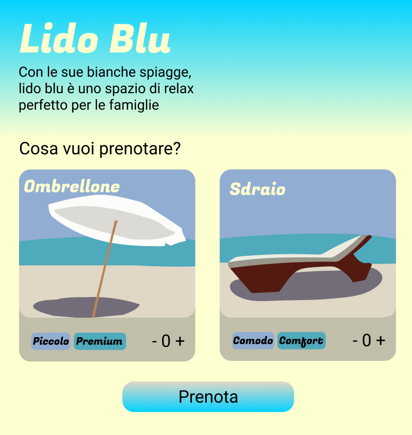
</h1>


   </td>
  </tr>
</table>


## Abbiamo la spiaggia per te

Per trovare la spiaggia perfetta, si dovrebbero percorrere le coste in lungo e in largo, prima di trovare quella che si adatta meglio alle nostre esigenze. 

Gli stabilimenti balneari sembrano tutti uguali, ma non tutti offrono gli stessi comfort. Spesso un lido viene scelto per il colore degli ombrelloni o il prezzo conveniente. 

Scegliere senza confrontare può portare a brutte sorprese: la rete Wi-FI lenta, una cattiva pulizia o l’assenza di attività ricreative. 

Vogliamo cambiare il modo in cui si prenota un posto in uno stabilimento balneare.

Il nostro obiettivo è rendere le spiagge più connesse, premiare i buoni servizi, creare un punto di contatto tra i clienti e i gestori dei lidi. 

Puoi prenotare la tua prossima spiaggia, in un battito di ciglia, dal nostro sito.


<table>
  <tr>
   <td>Cerca
<p>
Cerchi una spiaggia a Mykonos? Un ombrellone per ripararti dal caldo della Corsica? Uno sdraio per riposare sul lago di Garda? Abbiamo la spiaggia che fa per te, basta cercare!
   </td>
   <td>

<p id="gdcalert2" ><span style="color: red; font-weight: bold">>>>>>  gd2md-html alert: inline image link here (to assets/image2.png). Store image on your image server and adjust path/filename/extension if necessary. </span><br>(<a href="#">Back to top</a>)(<a href="#gdcalert3">Next alert</a>)<br><span style="color: red; font-weight: bold">>>>>> </span></p>


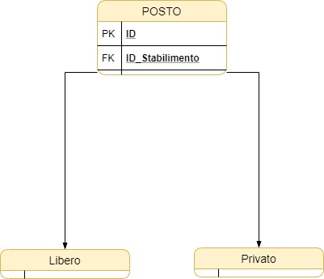

   </td>
  </tr>
  <tr>
   <td><p style="text-align: right">


<p id="gdcalert3" ><span style="color: red; font-weight: bold">>>>>>  gd2md-html alert: inline image link here (to assets/image3.png). Store image on your image server and adjust path/filename/extension if necessary. </span><br>(<a href="#">Back to top</a>)(<a href="#gdcalert4">Next alert</a>)<br><span style="color: red; font-weight: bold">>>>>> </span></p>


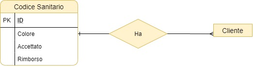
</p>

   </td>
   <td>Confronta
<p>
Puoi confrontare i migliori lidi in Europa, e scoprire se organizzano tornei di beach volley. Noi ti aiutiamo a trovare quello che fa al caso tuo.
   </td>
  </tr>
  <tr>
   <td>Viaggia
<p>
Non importa da dove arrivi o quale sia la tua meta: chiunque può registrarsi e prenotare in pochi click. Da smartphone, tablet o pc.
   </td>
   <td>

<p id="gdcalert4" ><span style="color: red; font-weight: bold">>>>>>  gd2md-html alert: inline image link here (to assets/image4.png). Store image on your image server and adjust path/filename/extension if necessary. </span><br>(<a href="#">Back to top</a>)(<a href="#gdcalert5">Next alert</a>)<br><span style="color: red; font-weight: bold">>>>>> </span></p>


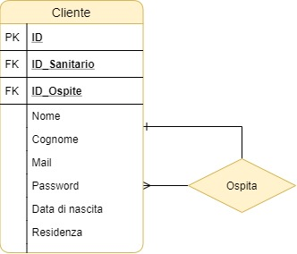

   </td>
  </tr>
</table>


In questo elaborato verranno analizzate queste parti del servizio: 


[TOC]


# Rete


## Applicazione

La nostra missione è quella di offrire un servizio veloce e accessibile da ogni parte d’Europa. 

Tradurre il sito nelle ventiquattro lingue europee non basta, serve che anche le tecnologie a supporto siano progettate in ottica internazionale: il servizio deve garantire prestazioni uniformi in ogni stato e gestire il carico delle richieste a seconda della domanda degli utenti. 

A queste esigenze ben si adatta una rete basata sul cloud computing pubblico, fornito in modalità IaaS, on demand e con pagamento in base alle risorse utilizzate.

L’architettura della rete è decentralizzata, organizzata in nodi disposti in diverse aree. In ogni stato europeo è presente un nodo, che gestisce le richieste in una zona.

 

<p id="gdcalert5" ><span style="color: red; font-weight: bold">>>>>>  gd2md-html alert: inline image link here (to assets/image5.png). Store image on your image server and adjust path/filename/extension if necessary. </span><br>(<a href="#">Back to top</a>)(<a href="#gdcalert6">Next alert</a>)<br><span style="color: red; font-weight: bold">>>>>> </span></p>


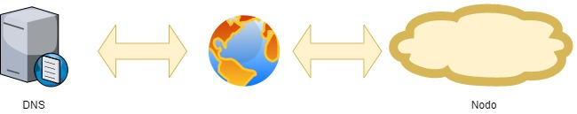


### Nodo

Ogni nodo ospita:


<p id="gdcalert6" ><span style="color: red; font-weight: bold">>>>>>  gd2md-html alert: inline image link here (to assets/image6.png). Store image on your image server and adjust path/filename/extension if necessary. </span><br>(<a href="#">Back to top</a>)(<a href="#gdcalert7">Next alert</a>)<br><span style="color: red; font-weight: bold">>>>>> </span></p>


[Schema completo](https://drive.google.com/file/d/19wG2Kp4pJ1i3h-K1S_ukSWLxcUL0V9-g/view?usp=sharing)


#### DBMS server

Utilizziamo MySQL per la sua affidabilità nella gestione di grandi quantità di dati e per le funzioni di crittografia in tempo reale.

Tutti i dati sono conservati nel rispetto della privacy degli utilizzatori secondo le norme Europee del [GDPR](https://www.privacy-regulation.eu/it/).

I dati conservati nel database e i backup vengono criptati attraverso la funzione TDE di MySQL, che garantisce sicurezza dei dati in tempo reale senza diminuire le prestazioni.


#### Server backend {#server-backend}

Gestisce la comunicazione tra il database e gli altri elementi nella rete attraverso gli api.  

Sono configurati due api RESTful:

Un api fornisce i dati al sito web.

Un api si occupa di condividere dati con gli altri nodi.

Ogni nodo interroga periodicamente gli api delle altre sedi per mantenere le proprie tabelle aggiornate.

Per garantire la sicurezza durante lo scambio dei dati, viene utilizzato il protocollo HTTPS.


#### Server front end

Il sito web è una single page application. 

Questo tipo di sito viene creato dinamicamente e fornisce una risorsa solo quando serve, mentre il resto dei dati rimane nei database, fino a quando non vengono richiesti dall’api.

Questa tecnologia garantisce flessibilità e modularità nello sviluppo del codice, rispetto a un sito generato da lato server.


#### Server AAA

Gestisce il processo di autenticazione degli utenti.

Il servizio prevede quattro account.


##### Visitatore

Non è richiesto un account. Può ricercare le spiagge e vedere il report statistico dei dati.


##### Cliente

Può creare il suo account, indicare il suo stato di salute e effettuare una prenotazione.


##### Stabilimento balneare

Può iscriversi alla piattaforma e aggiungere oggetti. 

Ha accesso alle sezioni del sito dedicate alla gestione dello stabilimento balneare. 

Non può vedere i dati personali degli utenti senza il loro consenso.


##### Sviluppatore

Ha tutti i privilegi, può modificare i servizi del cloud e inviare i cambiamenti.


#### Un firewall

Evita che protocolli indesiderati accedano allo spazio cloud e entrino in possesso dei dati conservati nel database.


#### Un proxy server

È configurato in modalità reverse: garantisce la cifratura HTTPS, oscura i server locali che hanno un indirizzo pubblico configurato e velocizza la comunicazione tra i server nel cloud. 


#### Bilanciatore di carico

Suddivide il carico di lavoro su più macchine e i server in base alla domanda dei client: se arrivano tante richieste, vengono aumentate le risorse, se diminuiscono, ridotte. Il lavoro di questo server è facilitato dalla scelta di eseguire i programmi dei server utilizzando un sistema Kubernetes.


### DNS Server


<p id="gdcalert7" ><span style="color: red; font-weight: bold">>>>>>  gd2md-html alert: inline image link here (to assets/image7.png). Store image on your image server and adjust path/filename/extension if necessary. </span><br>(<a href="#">Back to top</a>)(<a href="#gdcalert8">Next alert</a>)<br><span style="color: red; font-weight: bold">>>>>> </span></p>


Occupano un ruolo centrale nella gestione efficiente della rete decentralizzata. 

Al dominio del sito sono associati tutti i nodi della rete. Quando un utente interroga il dominio, il DNS server associa l’indirizzo ip del nodo più vicino.


## Azienda

L’azienda gestisce l’applicazione totalmente in smart working. 

Tutti i documenti aziendali vengono depositati su una suite cloud per facilitare la collaborazione tra gli impiegati.

Per proteggere i dati sensibili dalla lettura, sia durante il transito, che sul server, viene utilizzata la crittografia end to end.

Le riunioni aziendali avvengono in videochiamata e sono protette dal protocollo SRTP: fornisce crittografia in tempo reale ed è basato su UDP.


## Clienti


<p id="gdcalert8" ><span style="color: red; font-weight: bold">>>>>>  gd2md-html alert: inline image link here (to assets/image8.png). Store image on your image server and adjust path/filename/extension if necessary. </span><br>(<a href="#">Back to top</a>)(<a href="#gdcalert9">Next alert</a>)<br><span style="color: red; font-weight: bold">>>>>> </span></p>


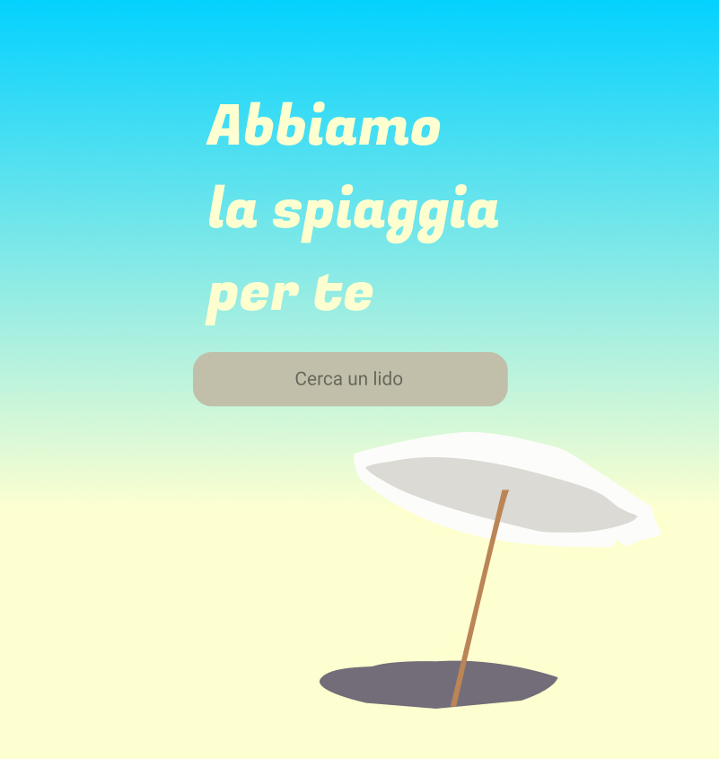


Gli utilizzatori finali utilizzano il servizio da cellulare e si connettono attraverso la rete mobile o WI-FI.


# Database

Questo è lo schema concettuale che verrà poi implementato nel database.


<p id="gdcalert9" ><span style="color: red; font-weight: bold">>>>>>  gd2md-html alert: inline image link here (to assets/image9.png). Store image on your image server and adjust path/filename/extension if necessary. </span><br>(<a href="#">Back to top</a>)(<a href="#gdcalert10">Next alert</a>)<br><span style="color: red; font-weight: bold">>>>>> </span></p>


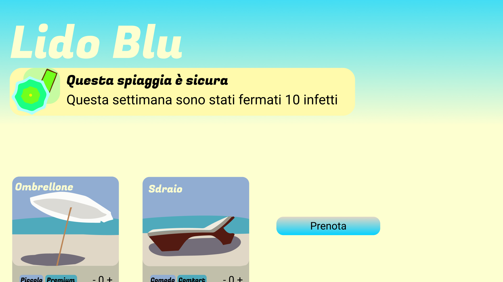


[Schema completo](https://drive.google.com/file/d/1PwGG0F34Fqp_PSOwHo-RPfLnFzvL65QI/view?usp=sharing)

Il database è diviso in tre macroaree: cliente, prenotazione e stabilimenti balneari.

Il database deve: 


*   Conservare i dati dei clienti sottoforma e associare loro un codice che identifica lo stato di salute
*   Permettere a un cliente di effettuare una prenotazione di uno sdraio o un ombrellone (in caso di una spiaggia privata) o di un posto in una spiaggia libera.
*   Permettere a ogni cliente di poter pagare in base al tempo di permanenza in spiaggia
*   Associare a ogni stabilimento balneare diversi posti e servizi


## Cliente

Contiene i dati dei clienti

Ogni cliente può portare con sé degli ospiti. 

Un ospite è un’associazione ricorsiva di un cliente.


<p id="gdcalert10" ><span style="color: red; font-weight: bold">>>>>>  gd2md-html alert: inline image link here (to assets/image10.png). Store image on your image server and adjust path/filename/extension if necessary. </span><br>(<a href="#">Back to top</a>)(<a href="#gdcalert11">Next alert</a>)<br><span style="color: red; font-weight: bold">>>>>> </span></p>


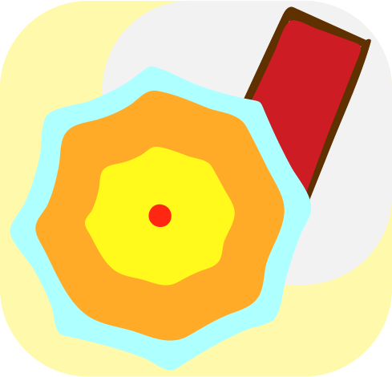


#### Schema logico

La tabella è stata lasciata inalterata perché i dati di un cliente raramente richiedono modifiche.

CLIENTE(<span style="text-decoration:underline;">ID, ID_Salute</span>, <span style="text-decoration:underline;">ID_Ospite</span>, Nome, Cognome, Mail, Password, Data_Nascita, Residenza)

ID -> Nome, Cognome, Mail, Password, Data_Nascita, Residenza

FK <span style="text-decoration:underline;">ID_Salute</span> REFERENCES STATO_SALUTE.ID

FK <span style="text-decoration:underline;">ID_Ospite </span>REFERENCES CLIENTE.ID


### Stato salute

A ogni cliente viene associato uno stato di salute.

Serve a stabilire l’idoneità del cliente all’accesso in spiaggia. Il significato di ogni codice di salute verrà spiegato nella sezione “Sistema di prenotazione”. 


<p id="gdcalert11" ><span style="color: red; font-weight: bold">>>>>>  gd2md-html alert: inline image link here (to assets/image11.png). Store image on your image server and adjust path/filename/extension if necessary. </span><br>(<a href="#">Back to top</a>)(<a href="#gdcalert12">Next alert</a>)<br><span style="color: red; font-weight: bold">>>>>> </span></p>


#### Schema logico

STATO_SALUTE(<span style="text-decoration:underline;">ID</span>, Colore, Accettato, Rimborso)

ID -> Colore, Accettato, Rimborso


## Prenotazione

Contiene i dati di una prenotazione di un cliente. 

Un cliente può effettuare più prenotazioni.


<p id="gdcalert12" ><span style="color: red; font-weight: bold">>>>>>  gd2md-html alert: inline image link here (to assets/image12.png). Store image on your image server and adjust path/filename/extension if necessary. </span><br>(<a href="#">Back to top</a>)(<a href="#gdcalert13">Next alert</a>)<br><span style="color: red; font-weight: bold">>>>>> </span></p>


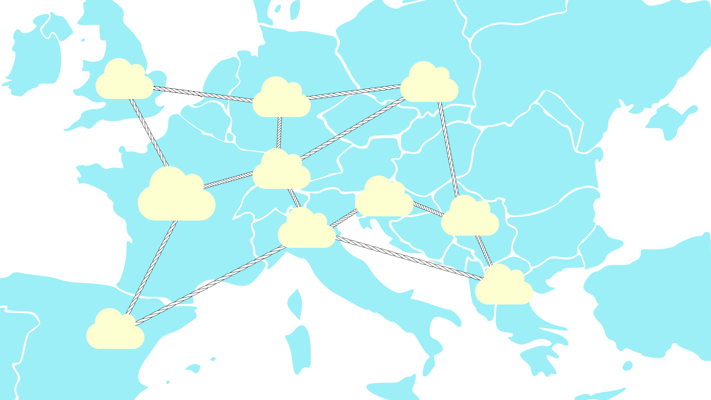


In ogni prenotazione è indicata la data di inizio della prenotazione e la data di fine. Se la data è superiore a quella odierna, la prenotazione è scaduta e il posto torna prenotabile. 

Si è deciso di aggiungere l’attributo ridondante Stato per ridurre il carico di lavoro nella ricerca di posti liberi. Questo valore viene aggiornato da server. 

Un posto può appartenere a una sola prenotazione per volta. 

La disponibilità di un posto è segnalata dall’attributo Stato. 

Questo valore serve per determinare se il posto è attivo. Si è preferito mantenere un’associazione N:N con posto piuttosto che una 1:N (con prenotazione 1 e posto N) per mantenere lo storico degli ordini dei clienti. 


#### Schema logico

PRENOTAZIONE(<span style="text-decoration:underline;">ID, ID_Cliente</span>, <span style="text-decoration:underline;">ID_Stato, </span>Data_Inizio, Data_Fine)

ID -> Inizio, Fine

FK ID_Cliente REFERENCES CLIENTE.ID

FK ID_Stato REFERECES STATO_PRENOTAZIONE.ID

Essendo Stato un attributo che necessita di un cambio di valore una volta scaduto il noleggio, è stato inserito in una tabella ausiliaria chiamata STATO_PRENOTAZIONE.

STATO_PRENOTAZIONE(<span style="text-decoration:underline;">ID</span>, Stato)

ID -> Stato


### Posto

Rappresenta tutto ciò che un cliente può prenotare.

Per ogni prenotazione possono essere riservati più posti. 

Ogni posto è rappresentato da una chiave primaria e viene associato alla tabella prenotazione in N:N e allo stabilimento in 1:N.

Si suddivide in libero e privato, per permettere l’utilizzo del servizio a spiagge libere e private.


<p id="gdcalert13" ><span style="color: red; font-weight: bold">>>>>>  gd2md-html alert: inline image link here (to assets/image13.png). Store image on your image server and adjust path/filename/extension if necessary. </span><br>(<a href="#">Back to top</a>)(<a href="#gdcalert14">Next alert</a>)<br><span style="color: red; font-weight: bold">>>>>> </span></p>


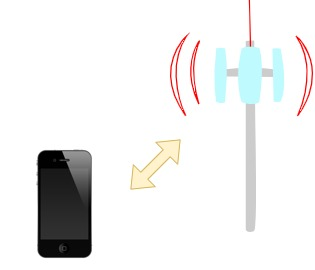


Un posto libero non ha attributi oltre alle chiavi, fisicamente è uno spazio vuoto sulla spiaggia. Questa tabella serve a stabilire se la capienza massima della spiaggia è stata superata.


<p id="gdcalert14" ><span style="color: red; font-weight: bold">>>>>>  gd2md-html alert: inline image link here (to assets/image14.png). Store image on your image server and adjust path/filename/extension if necessary. </span><br>(<a href="#">Back to top</a>)(<a href="#gdcalert15">Next alert</a>)<br><span style="color: red; font-weight: bold">>>>>> </span></p>


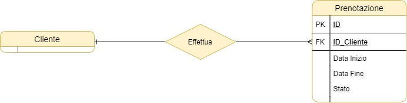


Un posto per essere privato deve avere al di sopra un oggetto. 

Questi oggetti possono essere uno sdraio o un ombrellone.


#### Schema logico

La traduzione logica richiede che siamo eliminate le generalizzazioni presenti nello schema concettuale. 

Le tabelle posto, privato e oggetto sono state accorpate nell'entità padre per evitare eccessive associazioni con la tabella prenotazione e permettere in futuro, di aggiungere altri oggetti (es. pedalò, campi da gioco).

POSTO(<span style="text-decoration:underline;">ID, ID_Stabilimento, </span>Nome, Prezzo_Ora, Numero_Serie, Colore, Capienza)

ID -> Nome, Prezzo_Ora, Numero_Serie, Colore, Capienza

FK ID_Spiaggia references Spiaggia.ID

Un posto, per essere libero deve avere nel nome POSTO_LIBERO e avere gli attributi Prezzo_Ora, Numero_Serie e Colore nulli.

Un posto, per essere uno sdraio, deve avere nel nome SDRAIO, l’attributo capienza nullo e il nome del colore dentro colore.

Un posto, per essere un ombrellone, deve avere nel nome OMBRELLONE e il valore della capienza dentro l’attributo capienza. 


## Stabilimento balneare

Uno stabilimento balneare rappresenta una spiaggia.

A uno stabilimento balneare corrispondono più posti.


<p id="gdcalert15" ><span style="color: red; font-weight: bold">>>>>>  gd2md-html alert: inline image link here (to assets/image15.png). Store image on your image server and adjust path/filename/extension if necessary. </span><br>(<a href="#">Back to top</a>)(<a href="#gdcalert16">Next alert</a>)<br><span style="color: red; font-weight: bold">>>>>> </span></p>


#### Schema logico

STABILIMENTO_BALNEARE(<span style="text-decoration:underline;">ID</span>, Nome, Descrizione, Capienza, Coordinate)

ID -> Nome, Descrizione, Capienza, Coordinate


### Servizio

Ogni stabilimento offre più servizi.


<p id="gdcalert16" ><span style="color: red; font-weight: bold">>>>>>  gd2md-html alert: inline image link here (to assets/image16.png). Store image on your image server and adjust path/filename/extension if necessary. </span><br>(<a href="#">Back to top</a>)(<a href="#gdcalert17">Next alert</a>)<br><span style="color: red; font-weight: bold">>>>>> </span></p>


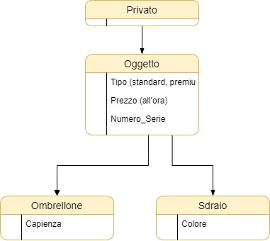


Il servizio è personalizzabile da ogni stabilimento. Un esempio di servizio possono essere una piscina o un bar.


#### Schema logico

STABILIMENTO_SERVIZIO(<span style="text-decoration:underline;">ID_Stabilimento, ID_Servizio</span>)

FK ID <span style="text-decoration:underline;">ID_Stabilimento </span>REFERENCES STABILIMENTO.ID

FK <span style="text-decoration:underline;">ID_Servizio </span>REFERENCES SERVIZIO.ID

SERVIZIO(<span style="text-decoration:underline;">ID</span>, Nome, Descrizione)


# Funzioni

In questa sezione verranno illustrate alcune funzionalità dell’app, con riferimento ad alcuni porzioni di codice che ne permettono il funzionamento. Il codice completo è visibile dalla [repository](https://github.com/defending1/suntan) o dall’archivio in allegato.


## Registrazione

Ogni utente può creare un account personale sulla piattaforma iscrivendosi attraverso un form.


<table>
  <tr>
   <td>

<p id="gdcalert17" ><span style="color: red; font-weight: bold">>>>>>  gd2md-html alert: inline image link here (to assets/image17.jpg). Store image on your image server and adjust path/filename/extension if necessary. </span><br>(<a href="#">Back to top</a>)(<a href="#gdcalert18">Next alert</a>)<br><span style="color: red; font-weight: bold">>>>>> </span></p>


   </td>
   <td><code><a href="https://github.com/defending1/suntan/blob/master/client/src/components/Subscribe/Form/index.js">Codice</a></code>
export const Form = () => { \
  const { register, handleSubmit } = useForm(); \
  const onSubmit = (values) => postData(values); \
  return ( \
    &lt;Container onSubmit={handleSubmit(onSubmit)}> \
      &lt;Input \
        ref={register} \
        name="Nome" \
        type="text" \
        placeholder="Nome" \
      /> \
      &lt;Input \
        ref={register} \
        name="Cognome" \
        type="text" \
        placeholder="Cognome" \
      /> \
      &lt;Input \
        name="Mail" \
        ref={register} \
        type="email" \
        placeholder="Email" \
      /> \
      &lt;Input \
        ref={register} \
        name="Password" \
        type="password" \
        placeholder="Password" \
      /> \
      &lt;Input \
        ref={register} \
        name="Data_Nascita" \
        type="date" \
        placeholder="Data di nascita" \
      /> \
      &lt;Input \
        ref={register} \
        name="Residenza" \
        type="text" \
        placeholder="Residenza" \
      /> \
      &lt;Button type="submit">Submit&lt;/Button> \
    &lt;/Container> \
  ); \
};<code> \
</code>
   </td>
  </tr>
</table>


Quando viene cliccato il tasto prosegui, viene chiamata la funzione postData che si occupa di mandare la richiesta al server attraverso una richiesta HTTPS.


### Client {#client}


```
const postData = async (values) => {
  axios
    .post(
      `http://localhost:${process.env.REACT_APP_SERVER_PORT}/add_client`,
      {
        params: {
          values,
        },
      }
    )
    .then((response) => {
      console.log(response.data);
    });
};
```


### Server {#server}

Il server riceve la richiesta e effettua una query INSERT nella tabella CLIENTE.


```
app.post("/add_client", function (req, res) {
  const data = req.body.params.values;

  const received = {
    ID: null,
    ID_Salute: null,
    ID_Ospite: null,
    Nome: data.Nome,
    Cognome: data.Cognome,
    Mail: data.Mail,
    Password: data.Password,
    Data_Nascita: data.Data_Nascita,
    Residenza: data.Residenza,
  };

  pool.query(
    `INSERT INTO CLIENTE SET ?`,
    received,
    (err, rows) => {
      if (err) throw err;
      res.json({
        status: 200,
        message: "New user added successfully",
      });
    }
  );
});
```


La tabella cliente nel database è:


```
CREATE TABLE cliente 
  ( 
     id           INT NOT NULL auto_increment, 
     id_salute    CHAR, 
     id_ospite    INT, 
     nome         VARCHAR (20) NOT NULL, 
     cognome      VARCHAR (20) NOT NULL, 
     mail         VARCHAR (50) NOT NULL, 
     password     VARCHAR (50) NOT NULL, 
     data_nascita DATE NOT NULL, 
     residenza    VARCHAR (100) NOT NULL, 
     PRIMARY KEY (id), 
     FOREIGN KEY (id_salute) REFERENCES stato_salute (id), 
     FOREIGN KEY (id_ospite) REFERENCES cliente (id) 
  ); 
```


l numero identificativo viene assegnato automaticamente dal database attraverso la funzione AUTO_INCREMENT.


## Sistema di prenotazione

In questo periodo la nostra azienda ha dovuto modificare il suo servizio per garantire la sicurezza nelle spiagge.

In un’area vasta come una spiaggia, dove l’affluenza di persone è alta, non è sufficiente provare la febbre con il termometro all’ingresso: è necessario che individuato un infetto, non possa rientrare in spiaggia.

Abbiamo quindi rivisto e modificato il processo di prenotazione, aggiungendo delle funzioni di gestione dello stato di salute dei clienti al database, al server e al sito. 

Come funziona?

Una persona sceglie gli oggetti da prenotare. 

Può scegliere tra uno sdraio, un ombrellone o un posto in una spiaggia libera.

Una volta scelto il posto da prenotare, viene aggiunto al carrello.


### Acquisto

Nel caso sia stato prenotato un oggetto a pagamento, paga (il pagamento viene gestito da un servizio esterno).


### Stato di salute

Una settimana prima dell’inizio della prenotazione, il sistema invia una mail all’ospite che lo invita a confermare il suo stato di salute. 


#### Conferma buona salute

Se assicura di stare bene, gli viene assegnato il codice verde.


#### Conferma malattia

Se invece comunica di avere sintomi, il codice diventa giallo per ricordare all’applicazione che l’ospite non può essere accettato, ma ha comunque diritto a un rimborso totale perché ha segnalato la condizione sanitaria in anticipo.


#### Mancata conferma

L’ospite ha tempo quattro giorni per confermare, se non conferma il suo codice diventa rosso, perde la prenotazione e perde il 20% della quota.


### Riconoscimento

All’ingresso della spiaggia il personale scannerizza il QR code del cliente e controlla il suo stato di salute utilizzando un termometro. 

In base a una stima delle condizioni di salute dell’ospite, decide se ammetterlo o respingerlo.


<table>
  <tr>
   <td>Cliente
<p>


<p id="gdcalert18" ><span style="color: red; font-weight: bold">>>>>>  gd2md-html alert: inline image link here (to assets/image18.jpg). Store image on your image server and adjust path/filename/extension if necessary. </span><br>(<a href="#">Back to top</a>)(<a href="#gdcalert19">Next alert</a>)<br><span style="color: red; font-weight: bold">>>>>> </span></p>


   </td>
   <td>Operatore
<p>


<p id="gdcalert19" ><span style="color: red; font-weight: bold">>>>>>  gd2md-html alert: inline image link here (to assets/image19.jpg). Store image on your image server and adjust path/filename/extension if necessary. </span><br>(<a href="#">Back to top</a>)(<a href="#gdcalert20">Next alert</a>)<br><span style="color: red; font-weight: bold">>>>>> </span></p>


   </td>
  </tr>
</table>


#### API

Prima dell’ingresso il cliente riceve via mail il QR code da presentare al check in della spiaggia.

Il valore del QR corrisponde a il codice identificativo dell’utente sul database.

L’addetto alla spiaggia controlla la temperatura del cliente con il termometro e indica al form se questo può essere ammesso spuntando “Si” o “No”. 

Il form viene inviato attraverso un api restful inserendo i dati nel corpo in formato json e viene fatta un’operazione post verso l’api all’indirizzo api.sandrent.com/beach_approval.

I dati della temperatura non vengono registrati nel form per preservare la privacy del cliente.

Il form viene inviato tramite il protocollo HTTPS per rendere i dati sicuri durante la trasmissione, grazie alla crittografia asimmetrica.

Il server estrae i dati in json, li inserisce dentro la stringa di query e li invia al database.

Il codice sanitario del cliente viene aggiornato in base allo stato di salute.


#### Ammesso

Se il cliente non mostra sintomi, il suo codice rimane verde.


#### Non ammesso

Se il cliente mostra sintomi il suo codice diventa rosso e viene respinto e perde il 30% della quota. 

Il cliente che non è stato ammesso deve attendere cinque giorni prima di prenotare di nuovo.

In questo arco di tempo il cliente potrà verificare meglio le sue condizioni di salute.

Questo sistema non assicura che il cliente possa prenotare e presentarsi nuovamente, né invia segnalazioni ai servizi sanitari. L’obiettivo è invitare l’utente ad attendere, prima effettuare un’altra prenotazione. 


## Indagine

Il settore del turismo sta attraversando una forte crisi, il lockdown ha tenuto le attività chiuse per mesi.

Le attività balneari devono garantire il rispetto delle norme di prevenzione, ma nelle spiagge è più difficile mantenersi distanti. 

Si potrebbe andare in contro a un calo delle prenotazioni per paura che le spiagge siano un luogo dove il virus possa diffondersi facilmente. 

Crediamo che il relax sia un diritto di tutti, e che la vacanza debba essere un momento di serenità.

Vogliamo rassicurare chiunque si trovi in una spiaggia, di essere al sicuro. 

Abbiamo deciso di pubblicare il numero delle persone fermate all’ingresso della spiaggia, le quali sarebbero potute essere dei potenziali diffusori del virus: grazie al sito queste persone con una potenziale infezione non hanno avuto accesso alla spiaggia. 

I dati di coloro che sono stati respinti rimangono nascosti nel database. Viene pubblicato esclusivamente il numero delle persone con temperatura superiore a 37.5 °C individuate in spiaggia.


<p id="gdcalert20" ><span style="color: red; font-weight: bold">>>>>>  gd2md-html alert: inline image link here (to assets/image20.png). Store image on your image server and adjust path/filename/extension if necessary. </span><br>(<a href="#">Back to top</a>)(<a href="#gdcalert21">Next alert</a>)<br><span style="color: red; font-weight: bold">>>>>> </span></p>


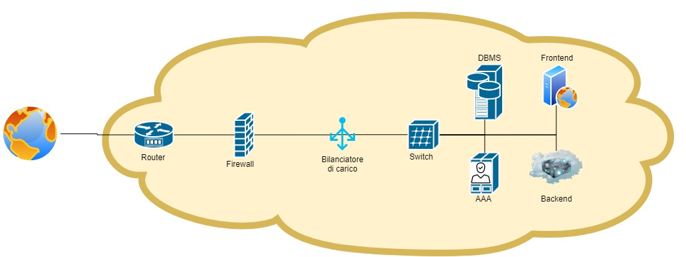


### Ricerca nel database

Per farlo, è stato necessario configurare le opportune query sul database.

È stata create una vista per velocizzare la ricerca di tutti i clienti con un codice rosso. Ogni tabella cliente viene unita alla tabella dello stato di salute e viene effettuato un controllo per ottenere le persone con codice rosso. Questa query viene conservata in una tabella virtuale, chiamata vista. 


```
CREATE VIEW ID_PERSONE_ROSSE 
AS 
  SELECT C.ID 
  FROM   CLIENTE C 
         JOIN STATO_SALUTE S 
           ON C.ID_Salute = S.ID 
  WHERE  S.Colore = "Rosso"; 
```


Questa vista contiene tutti gli identificativi degli stabilimenti balneari, delle prenotazioni e dei clienti. Sono state unite le tabelle prenotazione e posto, le quali sono unite tra loro in N:N.


```
CREATE VIEW STABILIMENTO_PRENOTAZIONE_CLIENTE 
AS 
  SELECT ID_Stabilimento, 
         ID_Prenotazione, 
         ID_Cliente 
  FROM   PRENOTAZIONE P 
         JOIN PRENOTAZIONE_POSTO P_P 
           ON P.ID = P_P.ID_Prenotazione 
         JOIN POSTO PO 
           ON P_P.ID_Posto = PO.ID 
```


Il database viene interrogato facendo un join tra le viste ID_PERSONE_ROSSE e STABILIMENTO_PRENOTAZIONE_CLIENTE. Il risultato del join viene unito alla tabella STABILIMENTO_BALNEARE.

Vengono contati gli infetti in un determinato stabilimento balneare facendo un COUNT sugli ID della vista ID_PERSONE_ROSSE.


```
SELECT Count(I.ID) 
FROM   ID_PERSONE_ROSSE I 
       JOIN STABILIMENTO_PRENOTAZIONE_CLIENTE SPC 
         ON SPC.ID_Cliente = I.ID 
       JOIN STABILIMENTO_BALNEARE S 
         ON S.ID = SPC.ID_Stabilimento 
WHERE  S.Nome = "Lido Blu"; 
```


Il client ottiene il numero di persone evitate e le mostra in questo conteggio nel banner nella pagina della spiaggia richiesta. 


## Suntan 
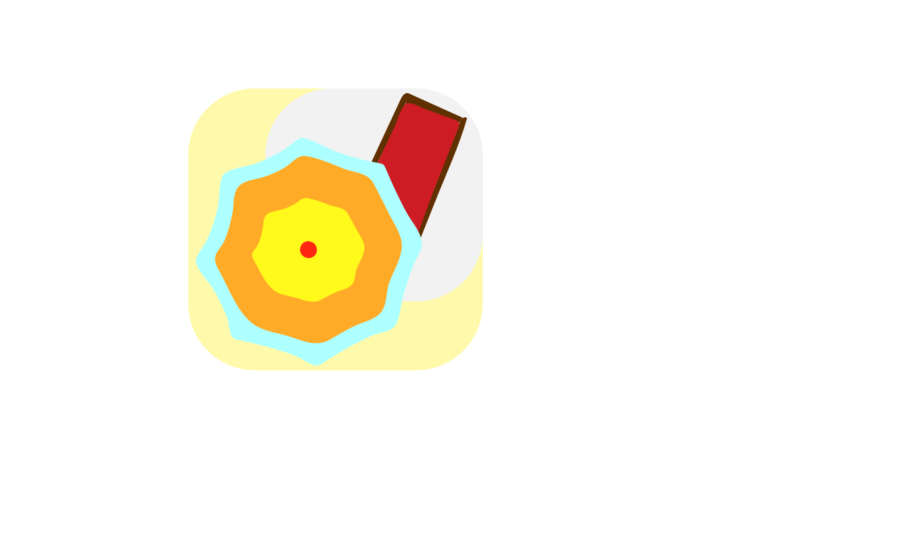

## Installation
```
docker-compose up
```